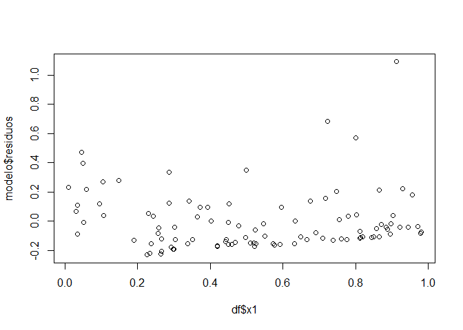
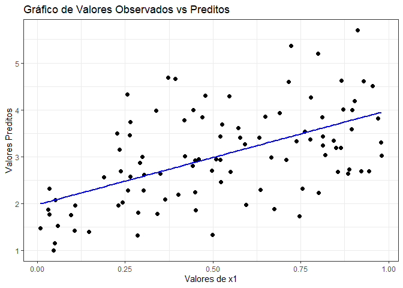

# RegLin

Este pacote tem como objetivo fornecer ferramentas para análise de
regressão linear tais como estimação e significância de parâmetros,
previsão e visualização da regressão modelada. O pacote também fornece
um conjunto de dados que pode ser usado no uso das funções e o qual é
dado como exemplo em suas documentações.

## Instalação

Voce pode instalá-lo diretamente através do Github seguindo:
[GitHub](https://github.com/) with:

``` r
# install.packages("devtools")
devtools::install_github("Julia256773/ME918-T2")
```

## Exemplo

Este é um exemplo simples de como você pode usar as funções do pacote:

``` r
library(pacote2)
```

Você pode obter informações sobre os coeficientes de um modelo de
regressão linear através da função reg_lin:

``` r
modelo = reg_lin(df, "y", c("x1", "x2", "x3"))

modelo$coeficientes
#>    betas      nomes coeficientes     p_valor     IC_inf      IC_sup
#> 1 beta 0 intercepto   -0.2309475 0.001751615 -0.3733309 -0.08856416
#> 2 beta 1         x1    2.0130277 0.000000000  1.8641478  2.16190766
#> 3 beta 2         x2    2.2088157 0.000000000  2.0600880  2.35754336
#> 4 beta 3         x3    2.2099940 0.000000000  2.0673860  2.35260204
```

Além disso, esta função também fornece os valores preditos do seu
conjunto de dados para a regressão modelada e seus respectivos resíduos.
Este pode ser apresentado por:

``` r
plot(df$x1, modelo$residuos)
```



O pacote também fornece formas de prever sobre o modelo a partir de
valores fornecidos os parâmetros:

``` r
valores = matrix(c(1, 5, 2,
                   2, 6, 4,
                   3, 7, 9), nrow = 3, byrow = TRUE)
predicts(modelo, valores)
#> [[1]]
#> [1] 17.24615
#> 
#> [[2]]
#> [1] 25.88798
#> 
#> [[3]]
#> [1] 41.15979
```

Por fim, também é possível visualizar o conjunto de dados e a sua reta
de regressão linear, tendo como referência um dos parâmetros e mantendo
os outros fixos os outros fixos. O gráfico do modelo de exemplo acima
pode ser acessado por:

``` r
graf_pvo(modelo, x_var = "x1", fixas = list(x2 = 0.5, x3 = 0.5), dados = df)
```


